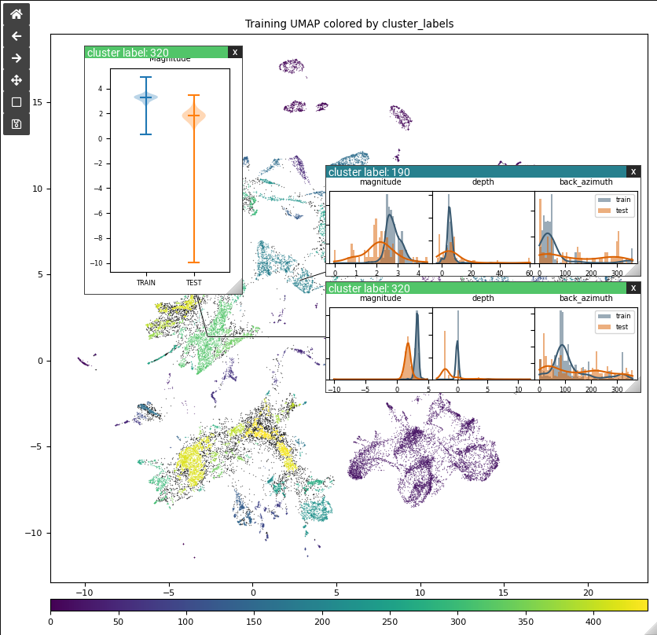
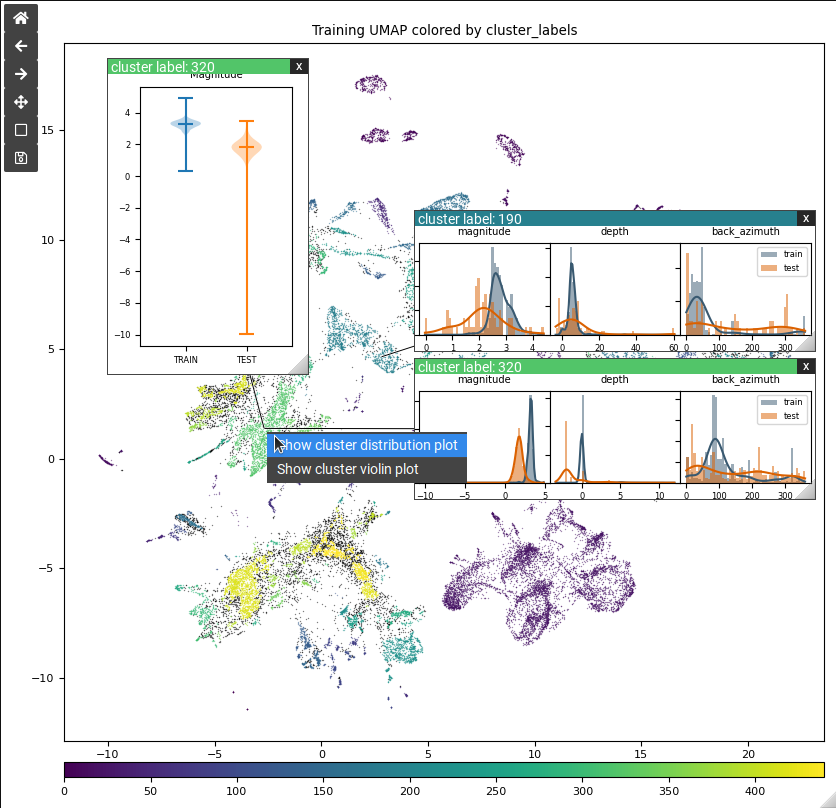
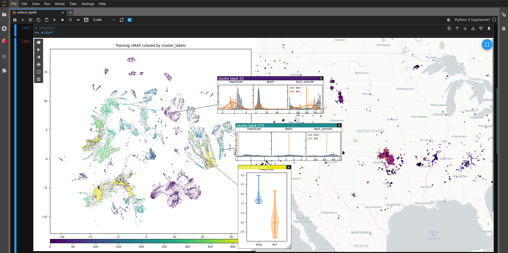

# IPyOverlay

[](https://github.com/psf/black)
[](https://badge.fury.io/py/ipyoverlay)
[](https://github.com/ORNL/ipyoverlay/blob/main/LICENSE)

IPyOverlay is a library of IPyWidget "wrapper components" that support rendering widgets on top of other
widgets with arbitrary/controllable positioning. This allows interfaces with
overlay elements, e.g. pop-up windows, custom context menus, etc.

The intent is to provide the mechanisms necessary to implement more complex
details-on-demand functionality (one part of the visual information-seeking mantra published
in [The Eyes Have it: A Task by Data Type Taxonomy for Information Visualizations](https://doi.org/10.1016/B978-155860915-0/50046-9)),
for dashboards and visualizations that allow a user to hone in and get more
in-depth information or additional plots when requested.


## Installation

IPyOverlay can be installed via `pip` with:

```
pip install ipyoverlay
```

## Documentation

User guide and API documentation can be found at [https://ornl.github.io/ipyoverlay](https://ornl.github.io/ipyoverlay/stable)

## Screenshots


A GIF demoing interaction with an ipympl Matplotlib figure. In the demo,
Clicking a cluster opens a pop-up window with a new figure.


The background Matplotlib figure shown is rendered as an interactive ipympl
widget and wrapped in IPyOverlay’s `OverlayContainer`, and shows a UMAP of
clustered embeddings. Clicking a cluster or right-clicking and selecting an
exhibit creates a click-and-draggable pop-up window containing a new
visualization that plots more details for the selected cluster. Optionally, each
pop-up window can show a line connecting the window to the center of the cluster
it is associated with in the underlying figure.


Custom actions can be added as A right-click menu to any widget. This menu is
specific to this Matplotlib UMAP and allows users to choose whether to open a
violin or distribution plot for the hovered cluster.


If multiple separate “background” widgets (Matplotlib UMAP on the left and
Plotly map on the right) are wrapped in an `OverlayContainer`, overlay widgets
can be displayed and dragged over all of them.

## Citation

To cite usage of IPyOverlay, you can use the following bibtex:

```bibtex
@misc{doecode_127817,
    title = {IPyOverlay},
    author = {Martindale, Nathan and Smith, Jacob and Linville, Lisa and Hite, Jason and Adams, Mark and Stewart, Scott},
    abstractNote = {IPyOverlay is a Python library that provides several IPyWidget components for use within the Jupyter software ecosystem. These components add novel UI capabilities to enable details-on-demand interaction paradigms by providing the ability to render widgets on top of other widgets with arbitrary and controllable positioning. This capability enables adding click-and-draggable overlay windows containing other widgets, right-click context menus, and more complex tooltip functionality.},
    doi = {10.11578/dc.20240530.1},
    url = {https://doi.org/10.11578/dc.20240530.1},
    howpublished = {[Computer Software] \url{https://doi.org/10.11578/dc.20240530.1}},
    year = {2024},
    month = {may}
}
```
